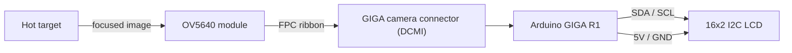
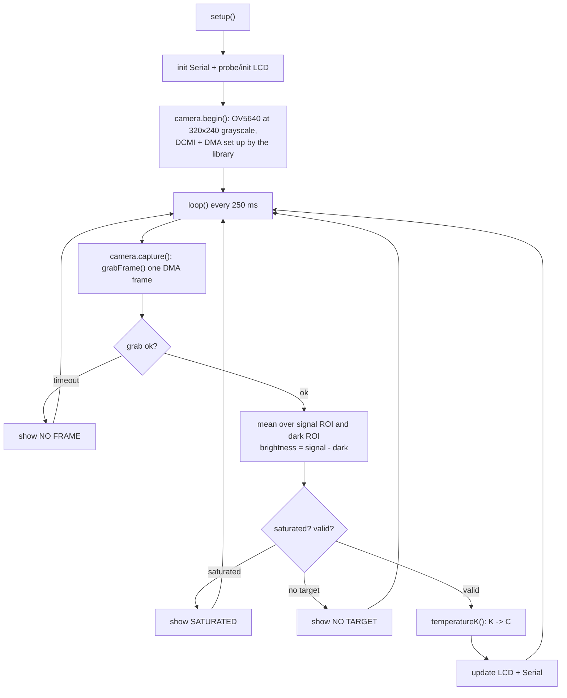

# Design guide

How TempCCD works, from the physics down to the code. If you just want to build
and flash it, the [README](../README.md) is enough — this is the write-up behind
it.

---

## 1. Principle

Hot things glow. Push a piece of metal past roughly 500 °C and it starts giving
off visible light, and the hotter it gets the brighter and bluer that glow
becomes. That relationship between temperature and emitted light is Planck's
law, and it's the whole basis for an optical pyrometer.

The OV5640 is just our light meter. We frame it on the hot target and read the
brightness of a small region of the image — a stand-in for how much light the
target is throwing into the camera's band. Turning that brightness into a
temperature uses the Wien approximation of Planck's law over the sensor's
effective band:

```
S = G · exp( -c2 / (lambda · T) )      =>      1/T = (A - ln S) / B
```

`S` is the measured brightness, `T` is temperature in kelvin, `B = c2 / lambda`,
and `A = ln G` rolls up everything we can't compute — optics, emissivity, sensor
gain. Two known temperatures pin `A` and `B`, and after that every brightness
reading maps to a temperature.

Three honest limits come straight out of the principle:

- A silicon sensor is blind to room-temperature thermal radiation. Below ~500 °C
  there's nothing in its band to see.
- The reading assumes your target radiates like the calibration source. A shiny,
  low-emissivity surface reads cold.
- **The OV5640 auto-exposes.** Left alone it constantly re-brightens the scene,
  which destroys any absolute brightness measurement. You have to lock exposure
  and gain at the sensor before the numbers mean anything — see
  [calibration.md](calibration.md). This is the cost of a consumer CMOS camera.

**Why DMA?** A 320x240 grayscale frame is ~77 kB, arriving 30 times a second. No
software read loop should be in that path. So the camera streams over the
STM32H7's DCMI interface and the Camera library DMAs each frame into memory; the
CPU only shows up once a whole frame has landed.

---

## 2. Configuration

Everything tunable lives at the top of `firmware/TempCCD/Config.h`:

| Setting | Constant | Value | Why |
|---|---|---|---|
| Resolution | `CAM_RESOLUTION` | 320x240 | small frame, cheap maths; the target only fills the ROI |
| Pixel format | `CAM_PIXFORMAT` | grayscale | 8-bit luma is all brightness needs |
| Frame rate | `CAM_FPS` | 30 | we sample a fraction of these |
| Grab timeout | `CAM_GRAB_TIMEOUT_MS` | 1000 ms | fail cleanly if a frame never lands |
| Signal ROI | `CAM_ROI_*` | 64x64 @ (128,88) | the box framed on the glow; CALIBRATE |
| Dark ROI | `CAM_DARK_*` | 32x32 @ (8,8) | a dark corner = zero-light reference |
| Saturation | `CAM_SATURATION_LEVEL` | 250 | peak at/above this is clipped |
| Eff. wavelength | `PYRO_LAMBDA_EFF_NM` | 600 nm | sets `B`; CALIBRATE |
| Gain const | `PYRO_DEFAULT_A` | 20.8 | sets the offset on the 8-bit scale; CALIBRATE |
| Sanity band | `PYRO_MIN/MAX_KELVIN` | 500–4000 K | reject nonsense results |
| LCD address | `LCD_I2C_ADDRESS` | 0x27 | PCF8574 default (0x3F on some) |
| Refresh | `DISPLAY_REFRESH_MS` | 250 ms | 4 Hz update, easy to read |

The pyrometry constants are placeholders. They produce a number, but not a
*correct* number until you run the calibration in [calibration.md](calibration.md).

---

## 3. Circuit diagram

There's barely a circuit to draw — the camera is digital and the LCD is I2C.



| From | To | Carries |
|---|---|---|
| OV5640 module | GIGA camera connector | the whole DCMI bus (data, pclk, hsync, vsync, SCCB, clock) over one ribbon |
| GIGA SDA/SCL | LCD SDA/SCL | I2C |
| GIGA 5V / GND | LCD | supply and ground |

That's the big simplification over a raw sensor: no master clock to generate, no
analog output to buffer, no level-shifting front-end. The OV5640 seats into the
GIGA's camera connector and the DCMI peripheral does the rest. Full seating notes
are in [wiring.md](wiring.md).

---

## 4. Algorithm

The camera free-runs and DMAs frames on its own. The main loop wakes on the
display cadence, grabs one finished frame, reads two regions of it, and does the
maths.



### Why a dark ROI

A 2D camera has no shielded reference pixels like a linear CCD does, so we take a
corner of the frame that stays out of the glow and use its mean as the
zero-light level. Subtracting it cancels the sensor's black-level pedestal and a
chunk of stray light, which is exactly what you want before reading brightness.
Frame it on something genuinely dark, or the readings sit low.

---

## 5. Program

The sketch is split so each file does one job. Full source is under
`firmware/TempCCD/`; here's the shape of it and the parts that matter.

| File | Responsibility |
|---|---|
| `Config.h` | camera mode, ROIs and the model constants |
| `CameraSensor.*` | OV5640 capture (DCMI + DMA) and ROI brightness |
| `Pyrometer.*` | brightness and the temperature math |
| `TemperatureDisplay.*` | the I2C LCD |
| `TempCCD.ino` | `setup()` / `loop()` glue |

### One thing to wire up first

The OV5640 driver isn't in the stock GIGA Camera library, so the include and
class at the top of `CameraSensor.h` point at where it lives in *your* camera
library:

```cpp
#include "OV5640/ov5640.h"   // match your installed OV5640-for-GIGA library
// ...
OV5640 sensor_;
Camera cam_{sensor_};
```

### Bringing up the capture (`CameraSensor::begin`)

The library configures DCMI and DMA internally; we just pick resolution, format
and frame rate:

```cpp
bool CameraSensor::begin() {
  return cam_.begin(CAM_RESOLUTION, CAM_PIXFORMAT, CAM_FPS);
}
```

### Reading a frame (`CameraSensor::capture`)

Grab one DMA frame, average the signal and dark ROIs, and report the
dark-subtracted brightness plus a saturation flag. `grabFrame` returns 0 on
success:

```cpp
if (cam_.grabFrame(fb_, CAM_GRAB_TIMEOUT_MS) != 0) return false;
const uint8_t* img = fb_.getBuffer();

const float dark   = meanOverRoi(img, CAM_DARK_X, CAM_DARK_Y, CAM_DARK_W, CAM_DARK_H, &darkPeak);
const float signal = meanOverRoi(img, CAM_ROI_X,  CAM_ROI_Y,  CAM_ROI_W,  CAM_ROI_H,  &peak);

out.brightness = max(0.0f, signal - dark);
out.saturated  = peak >= CAM_SATURATION_LEVEL;
out.valid      = (out.brightness >= PYRO_MIN_BRIGHTNESS) && !out.saturated;
```

`meanOverRoi` is a plain row-major walk over the box, one byte per pixel, stride
`CAM_WIDTH` — nothing clever, and easy to keep correct.

### Brightness to temperature (`Pyrometer`)

The Wien law solved for `T`, with guards so a bad reading returns `NAN` instead
of garbage:

```cpp
const float denom = a_ - logf(brightness);     // A - ln S
if (denom <= 0.0f) return NAN;                  // ran past the model's gain
const float kelvin = b_ / denom;               // T = B / (A - ln S)
if (kelvin < PYRO_MIN_KELVIN || kelvin > PYRO_MAX_KELVIN) return NAN;
```

Calibration is the inverse: given two `(brightness, temperature)` pairs,
`calibrateTwoPoint()` solves `B` from the slope and `A` from the intercept.

### The loop (`TempCCD.ino`)

Every 250 ms: grab a frame, read the ROIs, and turn the result into a
temperature on the LCD and over Serial. Saturated, empty or timed-out frames get
a status message instead of a bogus number.

That's the whole pipeline: **camera → DMA → brightness → pyrometry → LCD.**
