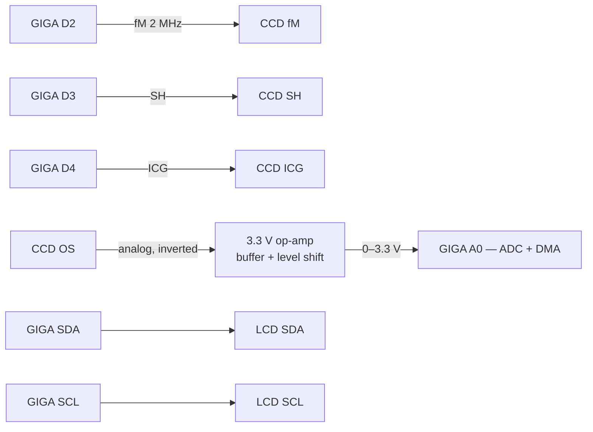
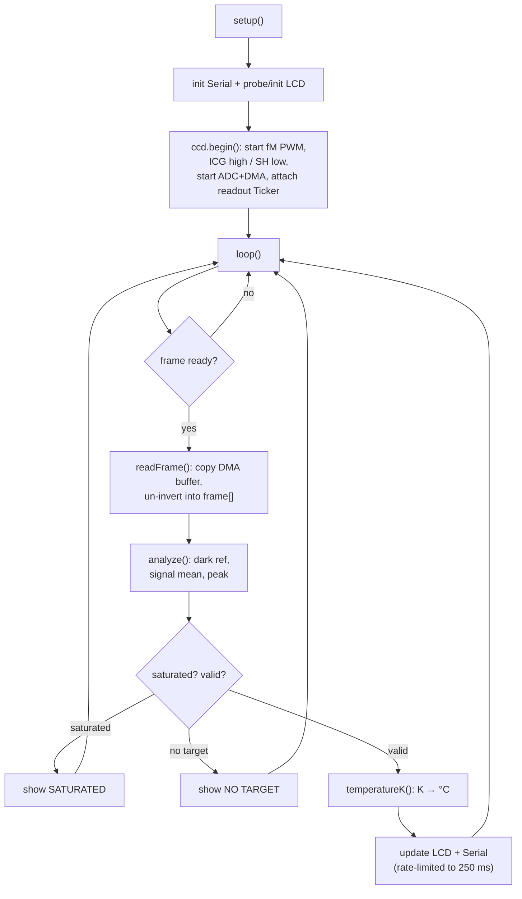

# Design guide

How TempCCD actually works, from the physics down to the code. If you just want
to build and flash it, the [README](../README.md) is enough — this is the
write-up behind it.

---

## 1. Principle

Hot things glow. Push a piece of metal past roughly 500 °C and it starts giving
off visible light, and the hotter it gets the brighter and bluer that glow
becomes. That relationship between temperature and emitted light is Planck's
law, and it's the whole basis for an optical pyrometer.

A linear CCD is just a long row of light buckets. We point it at the hot target,
let each bucket fill with charge for a fixed exposure, then read the whole row
out as a stream of pixel values. The brightness those pixels report is a stand-in
for how much light the target is throwing into the CCD's band.

Turning brightness into a temperature uses the Wien approximation of Planck's
law over the sensor's narrow effective band:

```
S = G · exp( -c2 / (lambda · T) )
```

`S` is the measured brightness, `T` is temperature in kelvin, `lambda` is the
effective wavelength, `c2 = 1.4388 x 10^7 nm·K` is the second radiation
constant, and `G` rolls up everything we can't compute from first principles —
optics, emissivity, sensor gain. Take logs and rearrange and it becomes a
straight line:

```
1/T = (A - ln S) / B        with  B = c2 / lambda,  A = ln G
```

So once we know `A` and `B`, every brightness reading maps to a temperature. We
don't try to derive `A` from theory — we pin both constants by measuring two
targets of known temperature and solving. That's the calibration step.

Two honest limits fall straight out of the principle:

- A silicon CCD is blind to room-temperature thermal radiation. Below ~500 °C
  there's simply nothing in its band to see.
- The reading assumes your target radiates like the calibration source. A shiny,
  low-emissivity surface reads cold.

**Why DMA?** One frame is 3694 pixels arriving at 500 kHz — a new sample every
two microseconds. No software read loop can keep up with that cleanly. So the
ADC is triggered by a hardware timer and drops every sample straight into memory
over DMA. The CPU only shows up once a whole frame has landed.

---

## 2. Configuration

Everything tunable lives at the top of `firmware/TempCCD/Config.h`. The values
that matter:

| Setting | Constant | Value | Why |
|---|---|---|---|
| Master clock | `CCD_MASTER_CLOCK_HZ` | 2 MHz | inside the TCD1304's 0.8–4 MHz window |
| Pixel rate | `CCD_PIXEL_RATE_HZ` | 500 kHz | the CCD emits one pixel every 4 fM cycles |
| Pixels / frame | `CCD_TOTAL_PIXELS` | 3694 | 32 dummy + 3648 active + 14 trailing |
| Frame period | `CCD_FRAME_PERIOD_US` | ~7388 µs | pixels ÷ pixel rate; also the exposure |
| Dark window | `CCD_DARK_FIRST/LAST` | 16–31 | shielded pixels = zero-light reference |
| Signal window | `CCD_SIGNAL_FIRST/LAST` | 40–3660 | the illuminated pixels, edges trimmed |
| ADC depth | `ADC_RESOLUTION_BITS` | 16 | the H7 ADC is natively 16-bit |
| DMA ring | `ADC_BUFFER_COUNT` | 4 | buffers cycling under the DMA controller |
| Eff. wavelength | `PYRO_LAMBDA_EFF_NM` | 600 nm | sets `B`; CALIBRATE |
| Gain const | `PYRO_DEFAULT_A` | 22.9 | sets the offset; CALIBRATE |
| Sanity band | `PYRO_MIN/MAX_KELVIN` | 500–4000 K | reject nonsense results |
| LCD address | `LCD_I2C_ADDRESS` | 0x27 | PCF8574 default (0x3F on some) |
| Refresh | `DISPLAY_REFRESH_MS` | 250 ms | 4 Hz update, easy to read |

The pyrometry constants are placeholders. They produce a number, but not a
*correct* number until you run the two-point calibration in
[docs/calibration.md](calibration.md).

---

## 3. Circuit diagram

Three digital lines drive the CCD, one analog line comes back through a
front-end, and the LCD hangs off I2C.



| From | To | Signal |
|---|---|---|
| GIGA D2 | CCD fM / MCLK | 2 MHz master clock |
| GIGA D3 | CCD SH | shift gate |
| GIGA D4 | CCD ICG | integration clear gate |
| CCD OS | front-end → GIGA A0 | analog pixel stream |
| GIGA SDA/SCL | LCD SDA/SCL | I2C |
| 5V / GND | CCD + LCD | shared supply and ground |

### Analog front-end (don't skip this)

The GIGA's analog inputs are **3.3 V and not 5 V tolerant**. The TCD1304's `OS`
output sits on a DC level near its supply with about a volt of swing, which is
well over 3.3 V — feed it in raw and you damage the pin. So `OS` goes through a
single-supply op-amp stage first:

```
          ┌──────────────── 3.3 V ────────────────┐
          │                                        │
 CCD OS ─►│  rail-to-rail op-amp (e.g. MCP6002)    │─► A0
          │  level-shift stage:  Vout = G·(OS−Vref)│   0–3.3 V
  Vref ──►│  choose G and Vref from the measured   │   low impedance
          │  OS swing so the line fills 0.1–3.2 V  │
          └────────────────────────────────────────┘
```

Running the op-amp on a single 3.3 V supply means its output physically can't
leave the 0–3.3 V rails, which protects the ADC for free; a Schottky clamp to
3.3 V is cheap insurance on top. Get the exact `G` and `Vref` with a scope on a
live readout.

One polarity note: `OS` is inverted — brighter light pulls it *down*. The stage
above keeps that polarity (bright stays low), and the firmware flips it in
software via `CCD_OUTPUT_INVERTED = true`. If you build an inverting stage
instead, set that flag to `false` so you don't double-invert.

Full pin tables, power and grounding are in [docs/wiring.md](wiring.md).

---

## 4. Algorithm

Two clocks run forever in the background: `fM` as a hardware PWM square wave, and
a Ticker that fires the readout sequence once per frame. The ADC streams pixels
into DMA the whole time. The main loop just waits for a finished frame and does
the math.



### Readout timing

Each frame starts with the SH/ICG handshake, then the CCD clocks all 3694 pixels
out on `fM/4`:

```
fM   ▏▏▏▏▏▏▏▏▏▏▏▏▏▏▏▏▏▏▏▏▏▏▏▏▏▏▏▏   free-running 2 MHz
ICG  ‾‾‾‾‾\______________/‾‾‾‾‾‾‾‾   low across the SH pulse, then high
SH   ________/‾‾‾\_________________   one short pulse starts the readout
         1µs  2µs  1µs    └─ pixels stream out here ─┘
```

### How the frame lines up with the DMA buffer

The ADC and the readout both advance at the same pixel rate, so each DMA buffer
holds one frame's worth of pixels at a constant offset. We don't chase exact
phase alignment in hardware — instead the dark window (pixels 16–31) and signal
window (40–3660) are placed with enough margin to absorb that fixed offset. The
dark pixels give a zero-light baseline; subtracting it kills the DC pedestal and
most of the drift, which is exactly what you want before reading brightness.

---

## 5. Program

The sketch is split so each file does one job. Full source is under
`firmware/TempCCD/`; here's the shape of it and the parts that matter.

| File | Responsibility |
|---|---|
| `Config.h` | every pin, timing and model constant |
| `CCDSensor.*` | the CCD clocks and the DMA-backed ADC capture |
| `Pyrometer.*` | brightness extraction and the temperature math |
| `TemperatureDisplay.*` | the I2C LCD |
| `TempCCD.ino` | `setup()` / `loop()` glue |

### Bringing up the capture (`CCDSensor::begin`)

`fM` is a hardware PWM pin, the gates are plain GPIO, and `AdvancedADC` wires the
ADC to a timer and a DMA ring in one call. Only after that does the readout
Ticker start.

```cpp
masterClock_ = new mbed::PwmOut(digitalPinToPinName(PIN_CCD_FM));
masterClock_->period(1.0f / static_cast<float>(CCD_MASTER_CLOCK_HZ));
masterClock_->write(0.5f);                       // 50% square wave

clearGate_ = new mbed::DigitalOut(digitalPinToPinName(PIN_CCD_ICG), 1);  // idle high
shiftGate_ = new mbed::DigitalOut(digitalPinToPinName(PIN_CCD_SH), 0);   // idle low

adc_.begin(adcResolutionEnum(ADC_RESOLUTION_BITS), CCD_PIXEL_RATE_HZ,
           ADC_SAMPLES_PER_BUFFER, ADC_BUFFER_COUNT);   // timer-triggered DMA

readoutTimer_.attach(&CCDSensor::readoutTrampoline,
                     std::chrono::microseconds(CCD_FRAME_PERIOD_US));
```

### The readout pulse (`CCDSensor::pulseReadout`)

Runs in interrupt context once per frame. Drop ICG, pulse SH while it's low,
raise ICG, and the pixels start streaming:

```cpp
*clearGate_ = 0;        // ICG low
delayMicroseconds(1);   // setup
*shiftGate_ = 1;        // SH high
delayMicroseconds(2);   // SH width
*shiftGate_ = 0;        // SH low
delayMicroseconds(1);   // hold
*clearGate_ = 1;        // ICG high -> readout begins
```

### Reading a frame without inversion (`CCDSensor::readFrame`)

Pull the newest DMA buffer, undo the optical inversion as we copy, and hand the
buffer back to the pool so DMA can reuse it:

```cpp
SampleBuffer buf = adc_.read();
for (size_t i = 0; i < buf.size() && i < CCD_TOTAL_PIXELS; ++i) {
  const uint16_t raw = static_cast<uint16_t>(buf[i]);
  dest[i] = CCD_OUTPUT_INVERTED ? ADC_FULL_SCALE - raw : raw;
}
buf.release();
```

### Brightness and temperature (`Pyrometer`)

`analyze()` takes the shielded pixels as a dark reference, averages the lit
pixels, and reports the dark-subtracted brightness plus a saturation flag.
`temperatureK()` is the Wien law solved for `T`, with guards so a bad reading
returns `NAN` instead of garbage:

```cpp
const float denom = a_ - logf(brightness);     // A - ln S
if (denom <= 0.0f) return NAN;                  // ran past the model's gain
const float kelvin = b_ / denom;               // T = B / (A - ln S)
if (kelvin < PYRO_MIN_KELVIN || kelvin > PYRO_MAX_KELVIN) return NAN;
```

Calibration is the inverse problem — given two `(brightness, temperature)`
pairs, `calibrateTwoPoint()` solves `B` from the slope and `A` from the
intercept:

```cpp
B = (ln S2 - ln S1) / (1/T1 - 1/T2);
A = ln S1 + B / T1;
```

### The loop (`TempCCD.ino`)

Nothing clever: wait for a frame, analyze it, and once every 250 ms turn the
result into a temperature on the LCD and over Serial. Saturated or empty frames
get a status message instead of a bogus number. Flip `DEBUG_DUMP_FRAME` to `1`
to stream raw pixels out for tuning the windows.

That's the whole pipeline: **CCD → DMA → brightness → pyrometry → LCD.**
