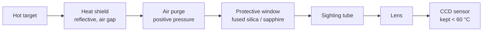

# Mounting and sensor protection

Pointing a CCD at something glowing hot is the easy part. Keeping the sensor
alive, keeping the optics clean, and aiming it the same way every time is what
actually takes thought. Here's how to set it up.

## Where to put the camera

**Stand back and let the lens do the work.** Radiant heat falls off fast with
distance, so the further away you mount the camera the lighter the thermal load
on it. Use the lens to image a small distant spot instead of crowding the
source. A TCD1304 wants to stay cool — commercial parts are usually happy from
roughly 0 to 60 °C, so check your datasheet and give yourself a wide margin.

**Stay out of the plume.** Hot air, smoke and spatter all rise. Mounting the
camera directly over the source drags that straight across the optics and bakes
the housing. Sight in from the side at an angle instead.

**Mount it rigid, and off the hot structure.** Vibration and thermal expansion
both move your aim, and aim is baked into the calibration. Anchor the camera to
its own stand, tripod or optical rail — never to the furnace itself — and use
low-conductivity standoffs so heat doesn't conduct up the bracket into the body.

**Lock the aim.** The brightness-to-temperature fit assumes fixed geometry:
distance, angle and the solid angle the target fills all fold into the gain
constant. Set the aim, lock the pan/tilt, and leave it. If the camera shifts,
the calibration drifts with it.

**Shield and cool the body.** Put a reflective heat shield with an air gap
between the source and the camera. For long runs add forced air across the
housing; for a serious furnace, a water-cooled jacket. Keep the cabling routed
well away from the hot zone — heat eats insulation.

## Protecting the sensor

Stack a few layers between the chip and the fire. Order matters; here's the
optical path from target to sensor:

**Protective window.** This is the main physical barrier — it blocks hot gas,
dust and spatter from ever reaching the lens. It has to pass the band the CCD
actually uses (visible into near-IR), and it has to survive the heat and the
thermal shock of a measurement starting and stopping.

| Window | Good for | Watch out for |
|---|---|---|
| Borosilicate (Pyrex) | cheap, clear in visible/NIR, light duty | cracks under fast thermal shock — keep it cool |
| Fused silica / quartz | best all-rounder, shrugs off big temperature gradients, wide visible–NIR | costs more than borosilicate |
| Sapphire | spatter, abrasion, molten metal, high pressure | expensive, and heavy ghosting if you don't tilt it |

All three pass the silicon band fine. Pick one that also passes your calibration
wavelength (the default model sits around 600 nm), because the window's
transmission becomes part of the measurement.

**Air purge.** A trickle of clean, positive-pressure air at the front aperture,
blowing outward. It keeps smoke and dust off the window and adds a little
cooling, and honestly it often does more to keep the optics clean than the
window itself. Worth fitting on anything dirty.

**Sighting tube.** A snout in front of the window restricts the field of view,
blocks stray off-axis radiation, and shields the glass. Purge it too if you can.

**Heat shield.** A reflective plate with an aperture and an air gap behind it,
protecting the window mount and the housing from the direct radiant blast.

**Shutter or cap.** Close the aperture when you're not measuring so the optics
aren't cooking continuously or collecting grime between runs.

### Installing the window

- **Don't clamp it tight.** Glass expands, and a rigid clamp cracks it on the
  first thermal shock. Hold it in a compliant retainer with a high-temp gasket —
  thin ceramic fibre or silicone — snug, not crushing.
- **Tilt it a few degrees** off perpendicular so reflections don't bounce
  straight back into the lens as ghost images.
- **Treat it as a consumable.** Build the holder so you can pop a fogged or
  spattered window out and drop a fresh one in within seconds, and keep spares.
- **Seal it to the purge path** so the clean air actually sweeps across the front
  face of the glass instead of leaking past it.

## What to make each part from

Same rule all the way through: each part wants to be either cool or
non-reflective, because anything hot or shiny in the field of view turns into
light the sensor reads as signal.

| Part | Default | Step up to | Keep away from |
|---|---|---|---|
| Heat shield | polished stainless (304/316) | stainless face + air gap + aluminized back layer; ceramic-fibre board behind | bare aluminum near real heat — melts at 660 °C |
| Standoffs and brackets | stainless | alumina ceramic at the hot end | aluminum bridging heat into the body |
| Purge gas | filtered, dried, oil-free air | nitrogen near molten metal or reducing atmospheres | wet or oily shop air |
| Purge plumbing at the aperture | stainless tube and fittings | — | plastic or PTFE in the hot zone |
| Window | fused silica (quartz) | sapphire for spatter, abrasion or pressure | plastics; borosilicate near fast thermal shock |
| Window gasket | thin ceramic fibre | graphite or vermiculite for very hot | rubber |
| Sighting tube | stainless, blackened and baffled inside | alumina or mullite ceramic at the tip; SiC for abrasive | a dark tube left to heat-soak |

A few things that don't fit in a table:

**Heat shield.** Polished stainless reflects well enough and keeps its shape;
aluminum reflects better but only survives where it stays well under its melting
point, so save it for a back layer behind a stainless face. For a furnace, stack
them with an air gap, and add ceramic-fibre board if conducted heat is a problem
too.

**Air purge.** The gas matters as much as the metal — oil or moisture baked onto
the window is worse than no purge at all. Keep stainless right at the hot
aperture; cheaper brass or plastic is fine further back where it stays cool.

**Window.** Already laid out in the table under *Protecting the sensor* — fused
silica by default, sapphire when it's taking hits. Whatever you use has to pass
your calibration wavelength.

**Sighting tube.** The one with a twist: matte black inside to kill stray
reflections, but kept cool so that black surface doesn't start glowing into the
lens itself. Stainless with a baffled, blackened bore handles moderate heat;
alumina or mullite ceramic is the move where the tip really cooks.

## Keeping the sensor cool isn't just about survival

Silicon dark current roughly doubles every 7–8 °C. So a hot CCD doesn't only
risk damage — its baseline climbs and wanders, which is exactly the drift the
dark-reference pixels are there to cancel. A cooler sensor gives a cleaner,
steadier reading. The shielding and cooling above buy you accuracy, not just
longevity.

## Calibrate with the whole stack in place

Every layer that passes light also dims it a little — the window, any filter,
even a slightly dusty purge. That attenuation lands in the gain constant `A`, so
install the full optical setup first and *then* run the two-point calibration in
[calibration.md](calibration.md). Swap the window or add a filter later, and you
calibrate again.
